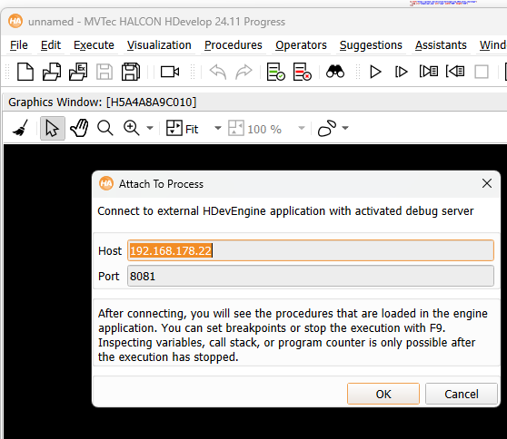

<!-- Improved compatibility of back to top link: See: https://github.com/othneildrew/Best-README-Template/pull/73 -->
<a id="readme-top"></a>
<!--
*** Thanks for checking out the Best-README-Template. If you have a suggestion
*** that would make this better, please fork the repo and create a pull request
*** or simply open an issue with the tag "enhancement".
*** Don't forget to give the project a star!
*** Thanks again! Now go create something AMAZING! :D
-->


<!-- PROJECT SHIELDS -->


<!-- PROJECT LOGO -->
<br />
<div align="center">
  <a href="https://github.com/mvtecsoftware/mvtec_itq_challenge_2026">
    
  </a>

<h3 align="center">MVTec Challenge - Garbage Collection Robot</h3>

</div>


<!-- TABLE OF CONTENTS -->
<details>
  <summary>Table of Contents</summary>
  <ol>
    <li><a href="#about">About The Project</a></li>
    <li><a href="#hardware-software">Hardware and Software Concept</a></li>
      <ul>
        <li><a href="#electrical">Electrical Diagram</a></li>
        <li><a href="#architecture">Software Architecture</a></li>
        <li><a href="#accessing">Accessing The Robots Operating System</a></li>
      </ul>
    <li><a href="#files">Files In This Repository</a></li>
    <li><a href="#getting-started">Getting Started</a></li>
    <li><a href="#tipps">Tips And Tricks</a></li>
    <li><a href="#license">License</a></li>
    <li><a href="#contact">Contact</a></li>    
  </ol>
</details>


<!-- ABOUT THE PROJECT -->
## <a name="about"></a> About The Project

Use computer vision and mobile robotics to clean our planet!

How can technology shape the future of waste management? Develop creative solutions for the automated detection and collection of waste - with a mobile platform, cameras and deep learning. Bring your expertise in the fields of software and hardware to the subtasks of robot control, navigation, image recognition and waste collection.

<p align="right">(<a href="#readme-top">back to top</a>)</p>

## <a name="hardware-software"></a> Hardware And Software Concept

As a starting point for this challenge, we have prepared a simple mobile robotics platform. 

It consists of a robot chassis with two chain drives, powered by 12V motors. The motor controller is managed by an Arduino. The Arduino allows for the connection of additional hardware. The Arduino itself is controlled via a serial port connection by the machine vision software running on an Nvidia Jetson Orin Nano. The machine vision software connects to the camera, analyzes the image content, and decides what to do next. It then sends simple commands to the Arduino to move the platform.

### <a name="electrical"></a> Electrical Diagram
  <a href="https://github.com/mvtecsoftware/mvtec_itq_challenge_2026">
    
  </a>

  <p align="right">(<a href="#readme-top">back to top</a>)</p>

### <a name="architecture"></a> Software Architecture
The image processing should run on the Nvidia Jetson Orin Nano which is mounted on the robotics platform.
It runs an Ubuntu Linux operating system.

The high level software is implemented in so called ```.hdev``` scripts in the MVTec HALCON programming language.
These scripts can be executed hy the ```hrun``` program. 


Example:
   ```sh
   hrun HelloWorld.hdev
   ```

Plugged to the Nvidia Jetson Orin Nano is a USB-to-Serial converter.
The HALCON scripts open a connection to the serial port which is available in Linux under ```/dev/ttyUSB0```.
   
This happens with the line
   ```sh
  open_file ('/dev/ttyUSB0', 'output', FileHandle)
   ```

The script can then send commands to the arduino in a very basic format which looks like ```:<Command>=<Value>!```.
As an example if the program sends ```:ML=120!``` it means set the power value of the left motor to 120.
What 120 exactly means is implemented in the Arduino program.

This is of course also possible to do with Python for instance, as demonstrated in the according scripts in 'robot_python'.

<p align="right">(<a href="#readme-top">back to top</a>)</p>

### <a name="accessing"></a> Accessing The Robots Operating System

The Jetson Orin Nano can be accessed via network either via an ethernet cable or wifi.

* Ethernet:

  Direct connect an ethernet cable and connect to the IP ```169.254.149.20```. Assign yourselfe a matching IP address or use 'Obtain an IP Address automatically'.
  Test if the login works with 
  ```sh
  ssh makeathon@169.254.149.20
  ```

* Wifi:

  Connect to the Wifi of the provided FritzBox. The Wifi access code can be found on the backside of the FritzBox.
  The robot should connect itself to the same Wifi automatically. It is reachable via the IP ```192.168.178.22```.
  Test if the login works with 
  ```sh
  ssh makeathon@192.168.178.22
  ```

* User:

  ```makeathon```

* Password:

  ```makeathon```


<p align="right">(<a href="#readme-top">back to top</a>)</p>

## <a name="files"></a> Files In This Repository

* __BeachBotty/BeachBotty.ino__: 
  
  Contains the Arduino Program. Has to be opened with the Arduino IDE.

* __robot_halcon/HelloWorld.hdev__: 

  Prints 'Hello World' to the commandline. Test it with ```hrun HelloWorld.hdev```.

* __robot_halcon/RobotDemo.hdev__: 

  Acquires one image from the camera to test that it works. Spins the left and right robot chain drive forwards and backwards for one second to test if it works. Test it on the robots Jetson Orin with ```hrun RobotDemo.hdev```.

* __robot_halcon/RobotDemoMouseControl.hdev__: 

  Allows to drive the robot around with the mouse while looking at the cameras live images. Requires access to the Linux GUI. Test it on the robots Jetson Orin with ```hrun RobotDemoMouseControl.hdev```.

* __robot_halcon/robot_functions.hdpl__: 

  A collection of HALCON procedures. They are used in RobotDemo.hdev and RobotDemoMouseControl.hdev.
  They can be used in the main .hdev file with the line ```include .```.

* __robot_python/robot_api_serial.py:__:

  Python API for direct serial communication with the Arduino (/dev/ttyUSB0).
  Handles motor control, servo control and automatic watchdog updates.
  Works only when executed directly on the robot (requires serial access).

* __robot_python/demo_serial.py:__:

  Simple example script using robot_api_serial.py. Drives forward, stops, turns and moves a servo.
  Run on the robot with ```python3 demo_serial.py```.

* __robot_python/robot_api_socket.py:__:

  TCP socket server that runs on the robot. Bridges network commands to the Arduino via serial.
  Must be started on the robot with ```python3 robot_api_socket.py``` and keeps running while waiting for client connections.

* __robot_python/robot_api_socket_client.py:__:

  Client-side API for controlling the robot via TCP. Can be executed either on the robot or on a student laptop (if connected to the same network).

* __robot_python/demo_socket.py:__:

  Example client script using robot_api_socket_client.py. Demonstrates basic driving and servo control over the network.

* __robot_python/demo_socket_keyboard_control.py:__:

  Keyboard control example using the socket API. Allows interactive driving over the network.

* __hdevengine/python_hdevengine_example.hdev:__:

  HALCON procedure file used by the Python example below. Contains a procedure that can be executed from Python via HDevEngine.

* __hdevengine/python_hdevengine_example.py:__:

  Python example showing how to execute HALCON code using HDevEngine. Calls the procedure from python_hdevengine_example.hdev and prints the results.


<p align="right">(<a href="#readme-top">back to top</a>)</p>

## <a name="getting-started"></a> Getting Started

1. Clone the repo
   ```sh
   git clone https://github.com/mvtecsoftware/mvtec_itq_challenge_2026.git
   ```
2. Copy the scripts to the Robot (Not strictly needed, an old version should already be there)
   ```sh
   scp -r robot_halcon makeathon@192.168.178.22:BeachBotty
   ```
3. Connect to the Robot via ssh
   ```sh
   ssh makeathon@192.168.178.22
   ```
4. Run the RobotDemo program. Hopefully the robot should respond by spinning its motors!  
   ```sh
   hrun RobotDemo.hdev
   ```
5. Develop and improve the robots software with HDevelop and Python.

<p align="right">(<a href="#readme-top">back to top</a>)</p>

## <a name="tipps"></a> Tips And Tricks

<p align="right">(<a href="#readme-top">back to top</a>)</p>

* __Serial vs Socket:__
Code running on the robot → use Serial.
Code running on a laptop → use Socket.

* __How to connect to the robot via SSH:__ 
  
   ```sh
   ssh makeathon@192.168.178.22
   ```
   and enter the password 'makeathon'

* __How to copy files to the robot:__ 

   ```sh
   scp <what> <user>@<target_machine>:<target_path>
   ```
   and enter the password 'makeathon'

* __How to connect to the Ubuntu GUI:__ 

  Use the windows tool 'Remote Desktop Connection'

    <a href="https://github.com/mvtecsoftware/mvtec_itq_challenge_2026">
      
    </a>

  You have to enter username and password multiple times.
  It is a good idea to choose a smaller resolution for the rdp connection to get a better update rate of the gui.

  <a href="https://github.com/mvtecsoftware/mvtec_itq_challenge_2026">
    
  </a>


* __How to use the HDevelop remote debugging functionality:__ 

  It is possible to run the HALCON scripts in interactive mode on the robot as well but this approach has a number of limitations.

  Start hrun with the ```--debug``` option, indicate a port to open and the procedure to debug. Example:
   ```sh
  hrun RobotDemo.hdev --debug 8081 -t robot_main
   ```
  
  hrun will wait for HDevelop to connect to it before it executes the script.
  Click 'Execute' -> 'Attach to Process' in HDevelops menu and provide IP address and port there.

    <a href="https://github.com/mvtecsoftware/mvtec_itq_challenge_2026">
    
  </a>


<!-- LICENSE -->
## <a name="license"></a> License

Distributed under the MIT license. See `LICENSE.txt` for more information.

<p align="right">(<a href="#readme-top">back to top</a>)</p>


<!-- CONTACT -->
## <a name="contact"></a> Contact

Lukas Ranftl - lukas.ranftl@mvtec.com

Philipp Junge - philipp.junge@mvtec.com

Project Link: [https://github.com/mvtecsoftware/mvtec_itq_challenge_2026](https://github.com/mvtecsoftware/mvtec_itq_challenge_2026)

<p align="right">(<a href="#readme-top">back to top</a>)</p>


